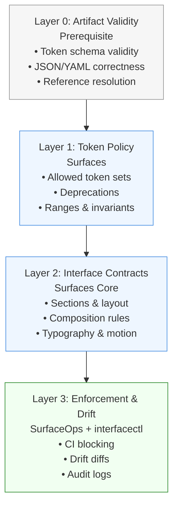

# Surfaces Validation Boundaries & Enforcement Model

This document defines **what Surfaces enforces**, **what it deliberately does not**, and **how validation responsibilities are layered** across the interface governance stack.

The goal is to keep Surfaces focused on **contract authority and enforcement**, while avoiding scope creep into lower-level primitives such as token authoring or schema tooling.

---

## Core Principle

> **Surfaces is a contract authority, not a primitive authoring tool.**

Surfaces enforces *designer intent* at the interface level. It assumes inputs are structurally valid and delegates primitive correctness to upstream validators.

---

## Validation Layers (Authoritative Order)

### Layer 0 — Artifact Validity (Prerequisite)
**Question answered:** *Is this artifact structurally valid and parseable?*

**Examples**
- W3C Design Tokens schema validity
- JSON / YAML correctness
- Reference resolution (no broken token links)

**Ownership**
- External validators or minimal built-in checks
- Examples: Anima Design Token Validator, JSON Schema, `ajv`

**Surfaces stance**
- Surfaces **requires** valid artifacts
- Surfaces does **not** define correctness rules at this layer

Invalid artifacts **halt validation immediately**.

---

### Layer 1 — Token Policy (Surfaces)
**Question answered:** *Are these valid tokens allowed in this context?*

**Examples**
- Allowed token sets per surface
- Deprecated or forbidden tokens
- Value ranges and fallbacks
- Cross-token invariants

**Ownership**
- Surfaces contracts

This is the **lowest layer Surfaces actively governs**.

---

### Layer 2 — Interface Contracts (Surfaces Core)
**Question answered:** *Does the interface obey designer intent?*

**Examples**
- Section and layout structure
- Width and grid constraints
- Component composition rules
- Typography and motion policies
- Surface-specific constraints

**Ownership**
- Surfaces contracts
- Contract schemas

This is the **core differentiation layer**.

---

### Layer 3 — Enforcement & Drift Detection (SurfaceOps)
**Question answered:** *Can this interface ship?*

**Examples**
- CI blocking
- Drift diffs
- Audit logs
- AI guardrails

**Ownership**
- SurfaceOps
- `interfacectl`

---

## Boundary Rule (Non‑Negotiable)

> **Surfaces never reports contract violations if artifact validity fails.**

Invalid inputs halt validation *before* token policy or interface contracts are evaluated.

This ensures deterministic behavior and clear attribution of failures.

---

## interfacectl Error Taxonomy

Errors are classified so they are **actionable**, **attributable**, and **scriptable**.

### E0 — Artifact Invalid
**Meaning**
- Input is malformed or non-conformant

**Examples**
- Invalid design token schema
- Broken references
- Invalid JSON

**Behavior**
- Validation stops immediately
- No contract evaluation occurs

**Audience**
- Token authors
- Build systems

---

### E1 — Token Policy Violation
**Meaning**
- Token is valid but not allowed by contract

**Examples**
- Deprecated token usage
- Token used outside allowed surface
- Value outside permitted range

**Behavior**
- Violations reported with token paths
- CI may fail depending on severity

**Audience**
- Design system owners

---

### E2 — Interface Contract Violation
**Meaning**
- Interface structure violates designer intent

**Examples**
- Invalid layout width
- Forbidden section hierarchy
- Disallowed component composition
- Motion rule violation

**Behavior**
- Structured drift diff generated
- CI fails by default

**Audience**
- Design and engineering leads

---

### E3 — Drift Detected (Non‑Blocking)
**Meaning**
- Interface changed but remains within allowed bounds

**Examples**
- Token changes within range
- Layout variation within contract limits

**Behavior**
- Diff recorded
- CI passes
- Audit trail updated

**Audience**
- Governance and audits

---

## Exit Code Contract

| Exit Code | Meaning |
|---------:|--------|
| 0 | Fully compliant |
| 10 | Artifact invalid (E0) |
| 20 | Token policy violation (E1) |
| 30 | Interface contract violation (E2) |
| 40 | Drift detected only (E3) |

This makes Surfaces predictable and safe to embed in CI/CD pipelines.

---

## Documentation Positioning (Anti‑Scope‑Creep)

### Short form
> Surfaces enforces interface contracts on top of valid design artifacts.

### Medium form
> Surfaces does not replace design token tooling. It assumes tokens are valid and focuses on enforcing how tokens, components, and layouts are allowed to be used together.

### Long form
Design token tools ensure correctness and portability. Surfaces ensures those tokens are used correctly, consistently, and safely across interfaces, teams, and AI‑generated outputs.

---

## North Star

> **Tokens define what exists.**  
> **Surfaces defines what is allowed.**

---

## Strategic Outcome

By enforcing these boundaries, Surfaces:
- Avoids primitive scope creep
- Preserves contract authority
- Supports heterogeneous inputs (human and AI)
- Remains focused on enforcement rather than authoring

